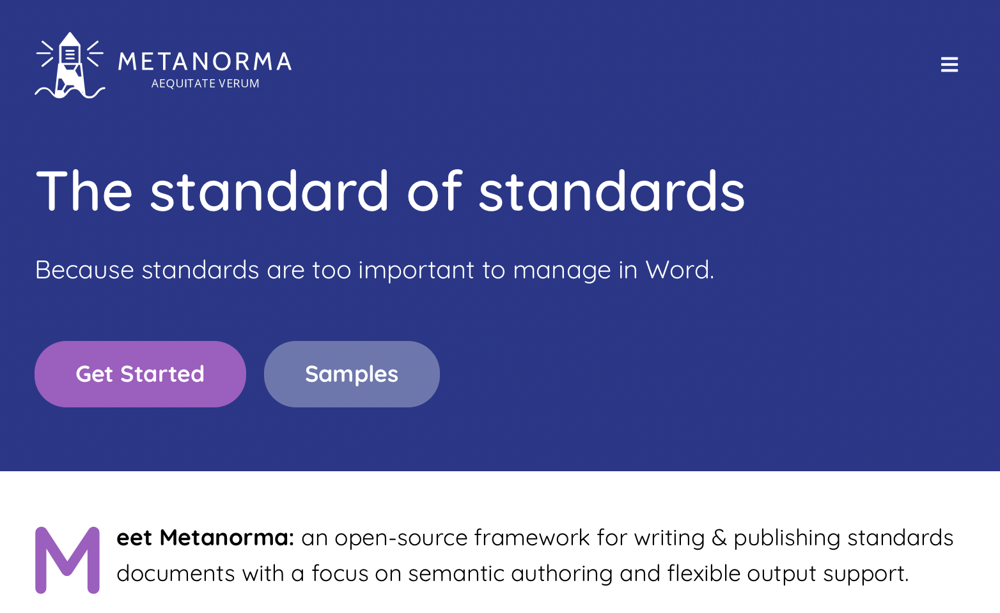
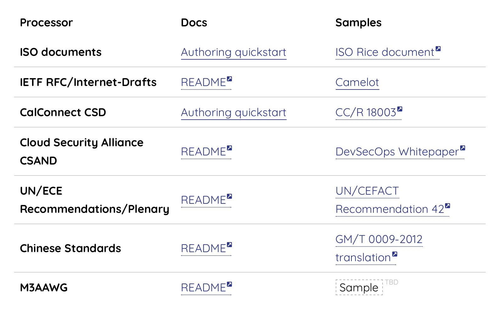
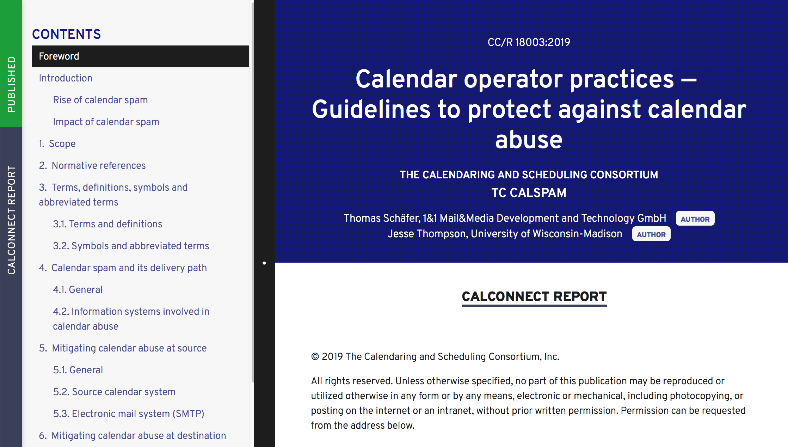
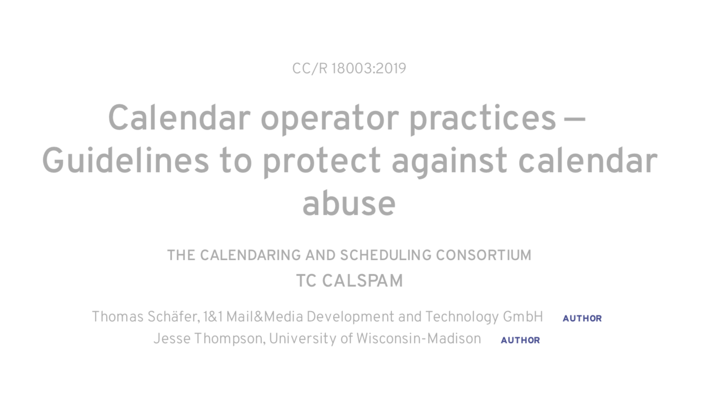
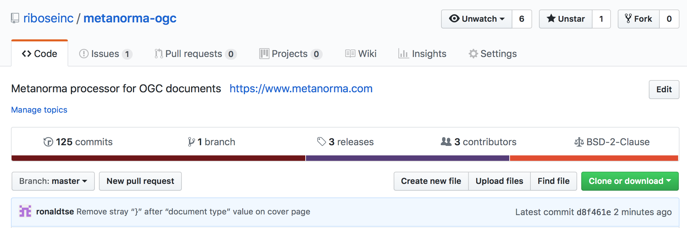
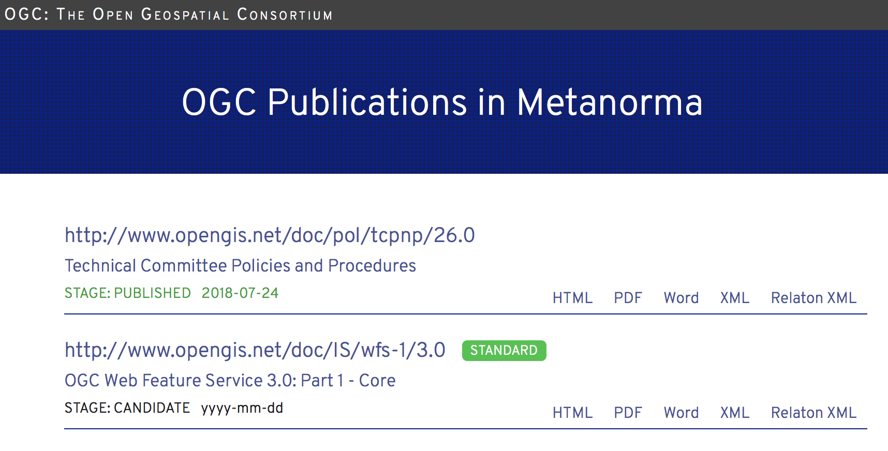
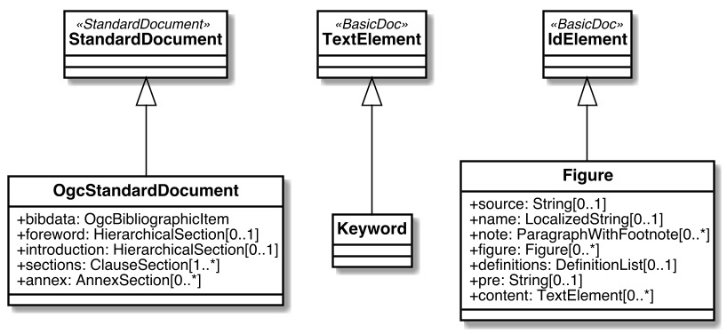
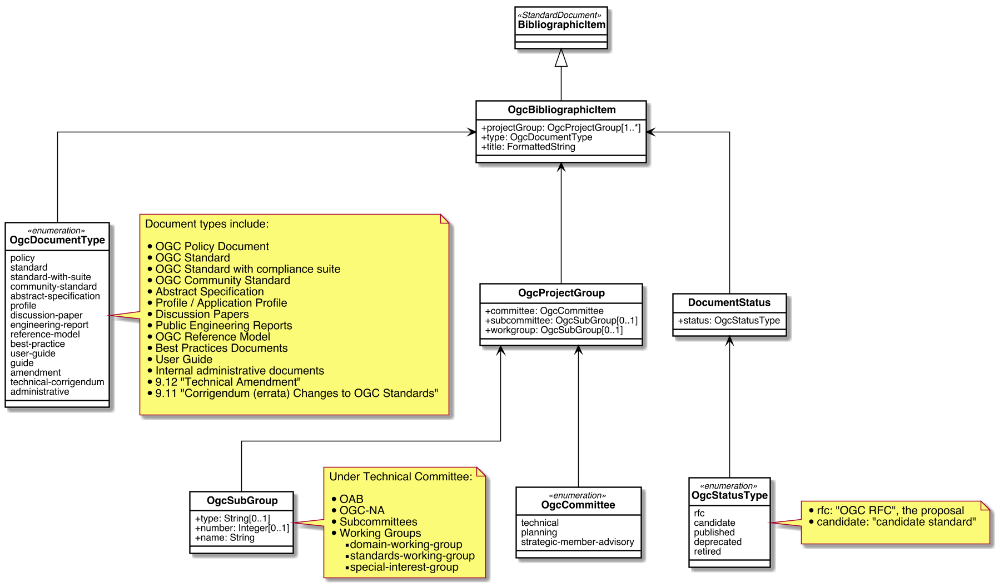

= DocTeam -- Metanorma for OGC
:revealjsdir: reveal.js/
:revealjs_customtheme: revealjs-css/ogc.css
:revealjs_width: "100%"
:revealjs_height: "100%"
:revealjs_margin: 0
:revealjs_minscale: 1
:revealjs_maxscale: 1
:icons: font
:source-highlighter: highlightjs

[.logo--banner]
Metanorma for OGC

[.logo--event]
110th OGC Technical Committee

Singapore, #OGC19S

February 25, 2019

Ronald Tse

* *Ribose* Founder and CEO

== Metanorma

[cols="a,a",options="header"]
|===
|End-to-end publication toolchain for standardization documents
|Supports multiple standardization bodies

|

|

NOTE: NIST is not publicly listed.

|===

== ISO/TC 154, ISO 36000 series "`Standardization documents`"

[cols="a,a",options="header"]
|===
|"`Standardization document`"
|ISO 36000 series

|
Document that _supports standardization activities_ or _produced through a standardization process_.

* Named with UN/CEFACT

Goals:

* *Separation of content and presentation concerns*
* Framework for standardization documents for SDOs
* Machine-useable content (e.g. Open API, such as sourcing a term)
* Structure-aware (e.g. content of "`Clause 5.1 b)`")

|
* ISO 36001 Standardization documents -- Metanorma -- Document metamodel
* ISO 36002 Standardization documents -- Metanorma -- Representation in XML
* ISO/NWIP Standardization documents -- Metanorma -- Requirements metamodel

Parties involved:

* Contributing: CalConnect, ISO/TC 154, ISO/TC 211, CSA
* In pilot: UN/ECE, NIST
* Collaborating: ISO/TC 46, ISO/IEC JTC 1 Ed. Forum, TEI

|===

== Metanorma is created by Ribose and standardized by ISO/CalConnect

[cols="a,a",options="header"]
|===
| Ribose: protection of freedom and liberty
| CalConnect: SDO for collaborative technologies

|
We focus on:

* *Security and privacy*
* *Open standards, transparency and interoperability*

We are the:

* Official "`ISO Geodetic registry`" (ISO 19127 RA)
* Official ISO/TC 211 web operator

|
* Member-driven non-profit consortium
* Topics: calendaring and scheduling, contacts and addressing, date and time
* Partners: *over 10 ISO Cat A liaisons*, OASIS, IETF, M3AAWG
* => Used by *over 3 billion devices* (iCalendar, vCard) and powers the *largest cloud services* today

|===

== Metanorma: Standard documents amongst SDOs can be standardized at the document model level

[cols="a,a",options="header"]
|===
| Context of standardization
| Purpose and requirements

|

[plantuml, diagrams/standard-process, png]
....
@startuml
!include style.uml.inc
:Process of developing standards (ISO DIR 1);
:**Meaning of standards (ISO 36003)**;
:**Structure of standards (ISO 36001)**;
:**Representation of standards (ISO 36002)**;
:Presentation of standards;
@enduml
....

|

=> Ensure *consistent structure* and *layout* of documents

The structure of standards (document requirements) is
often well-defined, e.g. ISO DIR 2, CalConnect CC/DIR 10002.

Common requirements include:

* boilerplate text; copyright / IPR statements;
* document structure, mandatory sections;
* terms and definitions;
* normative refs/bibliographic entries

|===

== Metanorma enables a unified, streamlined process for authoring standard documents

[cols="2*",options="header"]
|===
|What is it?
|Goals

a|
Metanorma ("`meta-standard`")

* enables *end-to-end, author-to-publish* standards creation workflow; and
* provides *semantic-aware standard documents*.

"`A common representation framework of standard documents.`" (document data model and data representation)

*Goal*: *any ISO document* can already be represented (and authored using Metanorma XML)

a|

* Unified representation of standard documents, from *data model* to *representation* to *presentation*
* Separation of content and presentation concerns: forget about formatting, styling adjustments
* End-to-end "`author-to-paper`" flow lets authors to self-iterate to ensure the output is as desired.
* Automatic generation of non-semantic elements: section numbers, cross-references, term sources, etc.

NOTE: A proper, semantic-standard format will rid of the need to "`re-edit`" documents.

|===

== Metanorma: how does it work?

Metanorma allows you to create a compliant standard document with minimal effort.

With a single command:

[source,sh]
----
$ metanorma -t ogc my-ogc-tc-document.adoc
# => Creates OGC document in XML, Word, HTML, PDF
----

=> _Fun fact:_ ISO/TC 154/WG 5 *ISO 8601-1* and *ISO 8601-2* were both submitted in Word generated using Metanorma.

== Metanorma adoption example: CalConnect enforces document requirements through technology

[cols="a,a"]
|===

|"`Metanorma for CSD`" provides:

* *CSD*, data model of a CalConnect Standard document, based on Metanorma's `StandardDocument`.
* *CSD XML*, the XML serialization schema for CSD.
* *Metanorma-CSD*, toolchain for authors to publish CSD documents.

|
Workflow:

[plantuml, diagrams/diagram-classes, png]
....
@startuml
!include style.uml.inc
:Input format;
:**CSD (model)**;
:**CSD XML (serialization)**;
:Rendered output;
@enduml
....

|===

== Metanorma-CSD in action: CalConnect CC/R 18003 in HTML and PDF

[cols="a,a"]
|===

|

|

|===

== Metanorma for OGC (software)

Metanorma processor for OGC: https://github.com/riboseinc/metanorma-ogc

== Metanorma-OGC in action: mini document registry

https://github.com/riboseinc/mn-ogc-documents

== Metanorma-OGC in action: TC PnP (HTML, Doc)

[cols="a,a",options="header"]
|===
|HTML
|Word

|image::images/mn-ogc-tcpnp-html.png[]
|image::images/mn-ogc-tcpnp-doc.png[]

|===

== Metanorma-OGC in action: WFS 3.0 (HTML, Doc)

[cols="a,a",options="header"]
|===
|HTML
|Word

|image::images/mn-ogc-wfs-html.png[]
|image::images/mn-ogc-wfs-doc.png[]

|===

== Authoring OGC-MN documents

Metanorma accepts AsciiDoc as input. The specific variant of AsciiDoc
is tailored for Metanorma, based on the syntax of
https://asciidoctor.org[Asciidoctor].

The following documents are available from Metanorma.com:

* Authoring guide
* Quickstart reference

No catch: The entire toolchain is open-source and free to use!

== Metanorma supported on Linux/macOS

Linux/others:

* as a Ruby gem: `gem install metanorma-cli`
* via Docker: https://github.com/riboseinc/metanorma-docker

macOS: via Homebrew (https://www.metanorma.com/blog/01-23-2019/metanorma-on-macos-via-homebrew/)

[source,sh]
----
$ brew tap riboseinc/metanorma
$ brew install metanorma
----

== Metanorma supported on Windows

Windows: via Chocolatey (PowerShell) (https://www.metanorma.com/blog/12-25-2018/metanorma-on-windows-via-chocolatey/)

[source,sh]
----
> Set-ExecutionPolicy Bypass -Scope Process -Force; iex ((New-Object System.Net.WebClient).DownloadString('https://chocolatey.org/install.ps1'))
> cinst ruby --version 2.5.3.101 -y
> cinst msys2 --params "/NoUpdate" -y
> $env:ChocolateyInstall = Convert-Path "$((Get-Command choco).path)\..\.."
> Import-Module "$env:ChocolateyInstall\helpers\chocolateyProfile.psm1"
> refreshenv
> ridk install 2 3
> cinst metanorma -y
> refreshenv
----

== Metanorma-OGC in action: OGC TC PnP document

Document example: https://github.com/riboseinc/ogc-tcpnp

Try it yourself!

[source,sh]
----
$ git clone https://github.com/riboseinc/ogc-tcpnp
$ cd ogc-tcpnp
$ metanorma ogc-tcpnp.adoc
$ # or `bundle install` and `bundle exec metanorma ogc-tcpnp.adoc`
----

NOTE: See links for rendered versions here: https://github.com/riboseinc/ogc-tcpnp

== Compiling the sample document via docker

In a directory containing the Metanorma document, run this:

[source,bash]
----
docker run                                                \
  -v "$(pwd)":/metanorma/  -t ${flavor}  -x ${extensions} \
  ribose/metanorma   ${my_document_file}
----

Where,

* `${my_document_file}` is the name of the Metanorma document file, such as
`ogc-12345.adoc`
* `${flavor}` is the flavor of Metanorma document, such as `ogc`
* `${extensions}` is a list of extensions desired, such as `xml,html,doc`

[source,bash]
----
docker run                                            \
  -v "$(pwd)":/metanorma  -t ogc  -x xml,html,pdf,doc \
  ribose/metanorma   ogc-tcpnp.adoc
----

Verify that the files have been compiled.

== Detailed steps to creating a Metanorma OGC document

1. Text input is in AsciiDoc ("`.adoc`") format

2. Compiling

** The toolchain compiles input text into an XML file called _OGC XML_, the serialization format of `OGC`.

3. Rendering

** The toolchain converts _OGC XML_ into the chosen output format, currently HTML, PDF and Word.

NOTE: In practice, steps 2 and 3 are automatic.

== Authoring Metanorma: OGC document attributes (1/3)

See the file `ogc-tcpnp.adoc` for
basic document headers necessary for an OGC document,
which are (mostly) self-explanatory.

[source,adoc]
----
= OGC Policy: Technical Committee Policies and Procedures // <1>
:docnumber: 05-020r26 // <2>
:doctype: policy      // <3>
:status: published    // <4>
:committee: Technical Committee // <5>
... (attributes omitted due to length)
----

<1> The "`= ...`" line on top defaults to the title of the document, it can be overriden by `:title:`
<2> `:docnumber:` is the OGC document number, which should be allocated by the TC.
<3> `:doctype:` can be `policy`, `standard`, `standard-with-suite`, `community-standard`, `abstract-specification`... (see documentation)
<4> `:status:` can be `rfc`, `candidate`, `published`, `deprecated`, or `retired`.
<5> `:committee:` one of `technical`, `planning`
and `strategic-member-advisory`

== Authoring Metanorma: OGC document attributes (2/3)

[source,adoc]
----
// ... (cont')
:external-id: http://www.opengis.net/doc/pol/tcpnp/26.0 // <1>
:edition: 26.0       // <2>
:submitted-date: 2018-02-14  // <3>
:issued-date: 2018-06-05
:published-date: 2018-07-24
:uri: http://docs.opengeospatial.org/pol/05-020r26/05-020r26.html // <4>
:pdf-uri: https://riboseinc.github.io/ogc-tcpnp/ogc-tcpnp.pdf
:xml-uri: https://riboseinc.github.io/ogc-tcpnp/ogc-tcpnp.xml
:doc-uri: https://riboseinc.github.io/ogc-tcpnp/ogc-tcpnp.doc
----

<1> The "`external ID`" of the OGC document.
<2> The edition/revision number of the document.
<3> `:*-date:` dates are called "`bibliographic dates`" where each denotes a transition of document stage. See documentation for accepted dates.
<4> `:*uri:` are static URIs pointing to generated artifacts.

== Authoring Metanorma: OGC document attributes (3/3)

[source,adoc]
----
// ... (cont')
:fullname: Scott Simmons <1>
:surname: Simmons
:givenname: Scott
:role: Editor <2>
:docfile: ogc-tcpnp.adoc <3>
:mn-document-class: ogc
:mn-output-extensions: xml,html,doc,pdf
:local-cache-only:  // <4>
:data-uri-image:    // <5>
//:draft            // <6>
----

<1> The three lines specifies contributors, a second author can be specified with `:fullname_2:`, etc.
<2> The role of a contributor.
<3> These three lines are Metanorma command-line arguments, not necessary for compilation, but enable an argument-less Metanorma CLI command
<4> `:local-cache-only` ensures the cache is stored in your
local directory to prevent unnecessary fetches of bibliographic entries.
This is necessary for using Docker.
<5> Specifies that images used in HTML output will be embedded in the HTML (single file)
<6> `:draft:` enables storing comments in XML and rendering of them in Word

== Authoring Metanorma: AsciiDoc formatting

[source]
----
*emphasizing*, _italicizing_, `monospace`
----

[source]
----
"`Pretty double quotes`", '`pretty single quotes`'
----

[source]
----
H~2~O for subscript, E=mc^2^ for superscript
----

NOTE: Remember to use pass:[stem:[xx]] for Math blocks!

== Authoring Metanorma: AsciiDoc lists and blocks

Unordered lists:

[source,adoc]
----
The main changes compared to the previous edition are:

* updated normative references;
* deletion of 4.3.
----

Ordered lists:

[source,adoc]
----
. the sampling method used;
. the test method used;
. the test result(s) obtained or the final quoted result obtained;
----

Definition lists

[source,adoc]
----
stem:[w]:: is the mass fraction of grains with defects in the test sample;
stem:[m_D]:: is the mass, in grams, of grains with that defect;
mag:: is the mass, in grams, of the aggregated test sample.
----

== Authoring Metanorma: Content body

[source,adoc]
----
.Preface
...

[abstract]
== Abstract
...

[[scope]]
== Scope
...

== Conformance
See <<scope>>.

[bibliography]
== References
...
----

== Authoring Metanorma: AsciiDoc tables, images, footnotes

A rather complex table:

[source,adoc]
----
[[tableD-1]]
[cols="<,^,^,^,^",headerrows=2]
.Repeatability and reproducibility of husked rice yield
|===
.2+| Description 4+| Rice sample
| Arborio | Drago footnote:[Parboiled rice.] | Balilla | Thaibonnet

| Number of laboratories retained after eliminating outliers | 13 | 11 | 13 | 13
| Mean value, g/100 g | 81,2 | 82,0 | 81,8 | 77,7
|===
----

Images (are figures) and footnotes:

[source,adoc]
----
[[figureC-1]]
.Typical gelatinization curve
image::images/rice_image2.png[]
footnote:[The time stem:[t_90] was estimated to be 18,2 min for this example.]
----

== Authoring Metanorma: AsciiDoc blocks

Admonitions (notes, warnings, cautions, etc.) and examples:

[source,adoc]
----
NOTE: It is unnecessary to compare rice yield across years.

[example]
5 + 3 = 8
----

Block quotes:

[source,adoc]
----
[quote,ISO,"ISO7301,clause 1"]
_____
This Standard gives the minimum specifications for rice (_Oryza sativa_ L.)
_____
----

Source code:

[source,adoc]
----
[source,some-lang]
------
function () -> {}
------
----

== Authoring Metanorma: term entry in T&D

The structure is strict; the following illustrates the complete structure of a term entry.

[source,adoc]
----
[[paddy]]                  // <= anchor
=== paddy                  // <= term
alt:[paddy rice]           // <= alternative term
alt:[rough rice]           // <= second alternative
deprecated:[cargo rice]    // <= deprecated term
domain:[rice]              // <= domain

rice retaining its husk after threshing  // <= definition

[example]              // <= example
Foreign seeds, husks, bran, sand, dust.

NOTE: The starch of waxy rice consists almost entirely of amylopectin.

[.source]
<<ISO7301,section 3.2>>, // <1>
The term "cargo rice" is shown as deprecated,
and Note 1 to entry is not included here.
----

<1> In the term source (`[.source]`), all content after the reference and the "`comma`"  is about "`modifications`" to the original definition.

== Authoring Metanorma: term entry sourced from the IEC Electropedia (IEV)

In the `[.source]`, a termbase such as the IEC Electropedia ("`IEV`") can be used, such as:

[source,adoc]
----
[.source]
<<IEV,clause "113-01-01">>, the term "space-time" is further explained
in a new Note 2 to entry.
----

References to the specific IEC 60500 documents (where IEV terms came
from) are automatically added to the Bibliography.

== Authoring Metanorma: Annex

Annexes have to be placed before the "`Bibliography`".

[source,adoc]
----
[[AnnexA]]
[appendix,subtype=informative]
== Example date and time expressions, and representations
...
----

== Authoring Metanorma: Symbols

[source,adoc]
----
== Abbreviations and acronyms

This Recommendation uses the following abbreviations and acronyms:

CM:: Cable Modem
CMTS:: Cable Modem Termination System
...
----

== Authoring Metanorma: References

[source,adoc]
----
[bibliography]
== References

* [[[OpenAPI,OpenAPI]]], _Open API Initiative: *OpenAPI Specification 3.0.1*_,
https://github.com/OAI/OpenAPI-Specification/blob/master/versions/3.0.1.md
* [[[rfc2616,IETF RFC 2616]]], _AUTOFILL_
...
----

== Metanorma: Rendering content for multiple publishers

What if I want to publish an ISO Standard from an OGC Standard?

Just substitute `-t ogc` with `-t iso` for the `metanorma` command.

[source,sh]
----
$ metanorma -t iso                \
            -x xml,html,pdf,doc   \
            my-rice-document.adoc
----

NOTE: Since the OGC structure is very similar to the ISO document structure,
no major structural changes are necessary (change of Foreword content is however necessary).

== Bibliography handling: Relaton

Document identifiers of certain standard bodies are automatically fetched
via a tool named Relaton.

This includes:

* ISO
* IEC
* IETF
* NIST pubs
* Chinese standards
* (soon CalConnect, ITU...)

Let's try adding one now.

== Bibliography handling: Adding an auto-fetch entry

In any bibliography section (i.e. "`Normative references`" or "`Bibliography`"),
add this line:

[source,adoc]
----
* [[[ISO27000,ISO 27000:2018]]], _ANYTEXT_
----

This means that the identifier "`ISO 27000:2018`" should be used to refer to the document for the reader, and `ISO27000` will be the handle. In the content, add a reference to this handle:

[source,adoc]
----
For vocabulary related to information security, please refer to <<ISO27000>>.
----

Compile the document, notice that it says `Fetching ISO 27000:2018 ...`.

Metanorma identifies the prefix given in "`ISO 27000:2018`" and knows to find it on https://www.iso.org. The resulting entry is actually "`ISO/IEC 27001:2018`" -- the correct entry is detected and automatically inserted in the bibliography.

The resulting information will be stored in a global (`~/.relaton`) or local cache (`./relaton`). Normally it only fetches once unless the entry expires.

== Bibliography handling: Adding a non-ISO auto-fetch entry

In normative references, non-CSD and non-ISO documents must still be given a document code (or title) in their bibliographic anchor:

[source,adoc]
----
* [[[RFC4291,IETC RFC 4193]]] _Unique Local IPc6 Unicast Addresses_,
    October 2005. http://www.ietf.org/rfc/rfc4291.txt
* [[IANAMediaTypes,IANA Media Types Assignment]]], March 2017.
    http://www.iana.org/assignments/media-types/media-types.xthml
----

In informative references, non-ISO documents are both displayed and cited with reference numbers in brackets. Those numbers are given in the reference anchor instead of the ISO document code. ISO references appear before non-ISO references; the reference number is expected to be correct in context:

[source,adoc]
----
* [[[IEC61010-2,IEC 61010-2:1998]]],
  _Safety requirements for electric equipment for measurement, control,
  and laboratory use -- Part 2: Particular requirements for laboratory
  equipment for the heating of material_

* [[[ref10,10]]] [smallcap]#Standard No I.C.C 167#.
  _Determination of the protein content in cereal and cereal products
  for food and animal feeding stuffs according to the Dumas combustion
  method_ (see http://www.icc.or.at)
----

== Adoption models: Metanorma-OGC (OgcStandardDocument) (1/2)

== Adoption models: Metanorma-OGC (OgcBibliographicItem) (2/2)

[.end]
== Thank you!

[.logo--event]
Questions welcome!

[.credit]
OGC

[.credit]
https://www.opengeospatial.org

